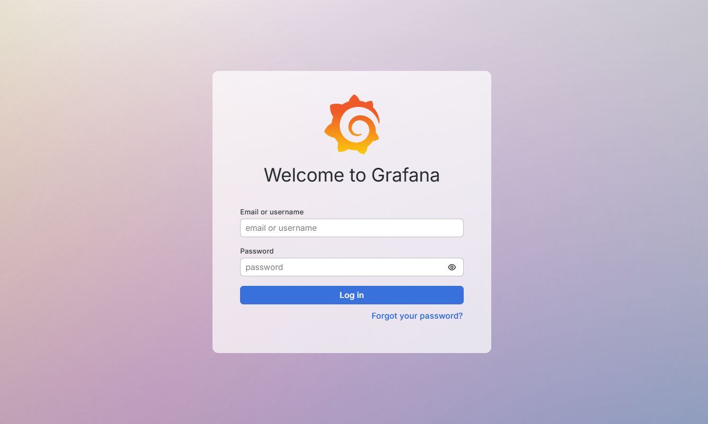
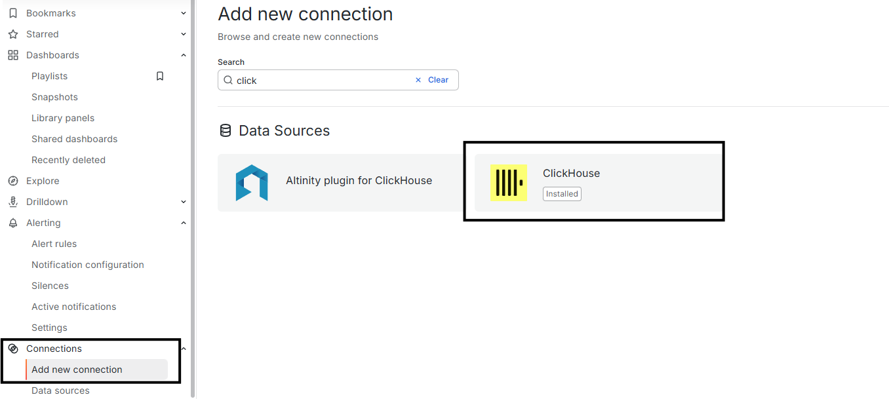
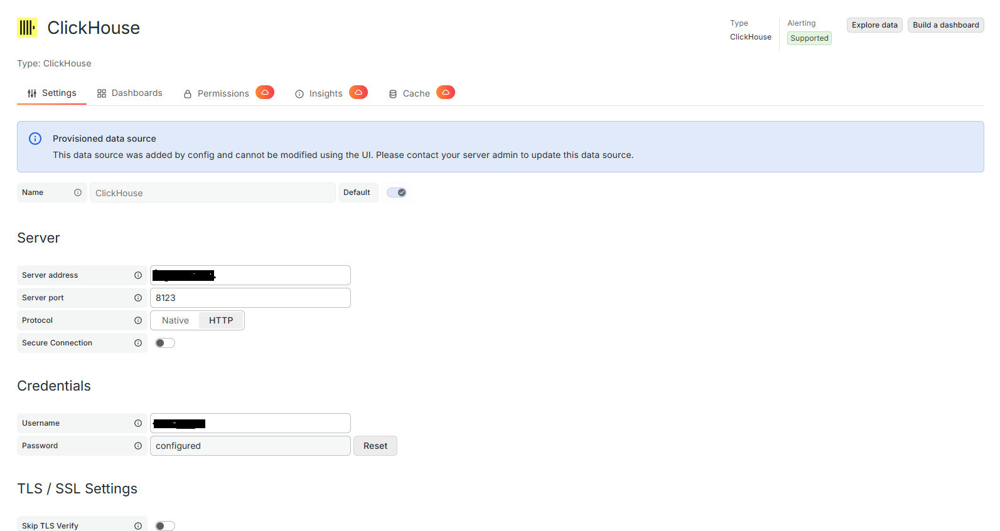
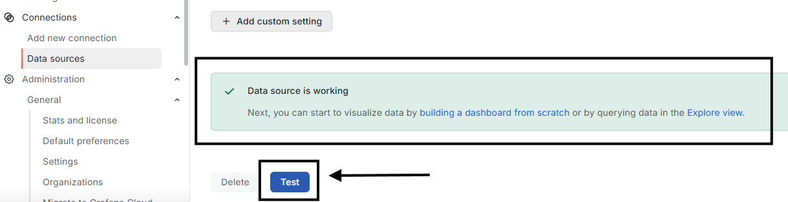

# Manual de Integración — Grafana + ClickHouse
### Grafana Cloud y On-Premise sobre ClickHouse existente

**Versión:** 1.2 · **Idioma:** Español · **Verificado a:** julio 2026 · **Alineado con:** archivos del repositorio (Docker Compose + nginx)
**Escenario base:** aprox. 15 usuarios · ClickHouse ya desplegado en el cliente · Objetivo: dashboards rápidos y de bajo costo sobre ClickHouse.

> **Por qué importa el despliegue:** Grafana no procesa los datos; los consulta directamente en ClickHouse y renderiza. Por eso la experiencia es más rápida cuanto más cerca (en red) esté Grafana de ClickHouse. Ambos despliegues —on-premise y Cloud— son válidos; este manual cubre los dos.

---

## 1. Arquitectura

Grafana es solo la **capa de visualización**. La consulta viaja: `Navegador → Grafana → (plugin ClickHouse) → ClickHouse → resultado → panel`. Los datos siguen viviendo en ClickHouse; Grafana no los almacena ni los duplica.

**Escenario A — On-Premise / self-hosted (recomendado para este caso):**
```
[Usuarios] --HTTPS--> [nginx/Caddy + SSL] --> [Grafana OSS] --Native/HTTP--> [ClickHouse]
                                                    |
                                    [Base de config de Grafana (SQLite por defecto)]
```

**Escenario B — Grafana Cloud (SaaS):**
```
[Usuarios] --HTTPS--> [Grafana Cloud] --Native/HTTP--> [ClickHouse]
```

---

## 2. El conector de ClickHouse

Para este proyecto usamos el plugin oficial **`grafana-clickhouse-datasource`**, mantenido y firmado por Grafana Labs, open-source y **gratuito**. Funciona igual en Grafana OSS y en Grafana Cloud, e incluye query builder, dashboards y alertas preconstruidos.

Tampoco es necesario contar con Grafana Enterprise.

> Nota: conviene que Grafana se conecte con un usuario de ClickHouse de **solo lectura**, restringido a las bases/tablas a visualizar.

---

# PARTE A — Despliegue On-Premise

> **Este manual está alineado con los archivos del repositorio que acompaña la instalación.** El método de referencia es **Docker Compose** (Grafana OSS + nginx como reverse proxy TLS). Las secciones A3 (instalación), A5 (provisioning), A6 (dominio) y A7 (SSL) describen exactamente lo que hay en el repo. La instalación por paquete APT se mantiene como alternativa.

## A0. Estructura del repositorio

```
.
├── docker-compose.yaml   # Grafana OSS + nginx (reverse proxy TLS)
├── nginx.conf            # Virtual host, redirección HTTP→HTTPS y WebSocket (Grafana Live)
├── .env.example          # Variables (dominio, admin, SMTP) — copiar a .env
├── certs/                # fullchain.crt + private.key (placeholders; poner los reales)
├── provisioning/         # Config como código de Grafana (ver Sección A5)
│   ├── datasources/      #   → clickhouse.yaml (data source de ClickHouse, ejemplo incluido)
│   ├── dashboards/       #   → proveedor de dashboards (vacío)
│   └── alerting/         #   → contact points / notificaciones (vacío)
├── templates/            # Templates de correo de alertas (branding) — ver Sección A9
└── docs/                 # Este manual
```

Los secretos (contraseña admin, SMTP) y el dominio **no** están hardcodeados: se leen de un archivo `.env` local (a partir de `.env.example`), que no se versiona.

## A1. Dimensionamiento del servidor (recursos mínimos)

Grafana es **liviano**: como ClickHouse hace el trabajo pesado, Grafana solo orquesta la consulta y renderiza. (Los requisitos altos de 16 vCPU / 64 GB que aparecen en la documentación de Grafana corresponden a los backends Mimir/Loki/Tempo, no a Grafana como app de visualización.)

| Perfil | vCPU | RAM | Disco | EC2 sugerido | Uso |
|---|---|---|---|---|---|
| Mínimo funcional | 1 | 2 GB | 20 GB SSD | `t3.small` | Pruebas / POC |
| **Recomendado (15 usuarios)** | **2** | **4–8 GB** | **20–30 GB SSD** | **`t3.medium` / `t3.large`** | **Producción de este caso** |
| Uso intensivo | 8+ | 16–32 GB | 100 GB+ SSD | `t3.xlarge`+ | Muchos dashboards pesados / alta concurrencia |

- Usar disco SSD (no HDD; impacta el tiempo de carga).
- Grafana no requiere disco grande: no guarda los datos analíticos (están en ClickHouse), solo la app y su base de configuración.
- Costo orientativo: un servidor de 2 vCPU / 4 GB ≈ **USD 15–20/mes** en la nube. Un servidor existente también sirve.

## A2. Base de datos de configuración de Grafana (opcional)

Grafana guarda usuarios, dashboards y ajustes en una base interna. Por defecto usa **SQLite** (un archivo local), y para una **instancia única con aprox. 15 usuarios es más que suficiente y estable** — no requiere nada adicional.

Una base externa (**PostgreSQL** o MySQL) es **opcional** y solo aporta valor si en el futuro se necesita **alta disponibilidad** (varias instancias de Grafana detrás de un balanceador) o respaldos centralizados. Para este proyecto: **dejar SQLite** y no añadir complejidad.

## A3. Instalación de Grafana

**Método del repositorio — Docker Compose (`docker-compose.yaml`).** Levanta dos servicios en la misma red: `grafana` (OSS) y `nginx` (reverse proxy con TLS). Grafana solo se publica en `127.0.0.1:3000` para desarrollo; el acceso público es por nginx (443). El plugin de ClickHouse se instala solo al arrancar.

**Paso 1 — variables de entorno.** Copiar `.env.example` a `.env` y completar dominio y credenciales:
```bash
cp .env.example .env
# editar .env:
#   GRAFANA_DOMAIN=grafana.tu-dominio.com
#   GF_SECURITY_ADMIN_USER=admin
#   GF_SECURITY_ADMIN_PASSWORD=CAMBIAR_ADMIN_FUERTE
```

**Paso 2 — `docker-compose.yaml`** (extracto del servicio de Grafana; el archivo real incluye además el servicio `nginx`, ver Sección A7):
```yaml
services:
  grafana:
    image: grafana/grafana-oss:latest   # OSS (gratuito). Recomendado fijar versión, p. ej. :11.6.0
    container_name: grafana
    restart: unless-stopped
    ports:
      - "127.0.0.1:3000:3000"           # solo dev; en prod se accede vía nginx (443)
    environment:
      - GF_SERVER_DOMAIN=${GRAFANA_DOMAIN}
      - GF_SERVER_ROOT_URL=https://${GRAFANA_DOMAIN}/
      - GF_SERVER_ENFORCE_DOMAIN=true
      - GF_SECURITY_ADMIN_USER=${GF_SECURITY_ADMIN_USER}
      - GF_SECURITY_ADMIN_PASSWORD=${GF_SECURITY_ADMIN_PASSWORD}
      - GF_USERS_ALLOW_SIGN_UP=false
      - GF_USERS_DEFAULT_THEME=light
      - GF_INSTALL_PLUGINS=grafana-clickhouse-datasource 3.3.0   # versión del plugin fija (reproducibilidad)
      - GF_PATHS_PROVISIONING=/etc/grafana/provisioning
    volumes:
      - ./templates/ng_alert_notification.html:/usr/share/grafana/public/emails/ng_alert_notification.html:ro
      - ./templates/ng_alert_notification.txt:/usr/share/grafana/public/emails/ng_alert_notification.txt:ro
      - ./provisioning:/etc/grafana/provisioning   # ver Sección A5
      - storage:/var/lib/grafana                   # config de Grafana (SQLite) — respaldar este volumen

volumes:
  storage: {}
```
Para levantar los servicios se usa `docker compose up -d`; los logs se consultan con `docker compose logs -f grafana`.

> Notas de configuración importantes:
> - **`GF_SERVER_ENFORCE_DOMAIN=true` requiere `GF_SERVER_DOMAIN`/`ROOT_URL` definidos** (vía `.env`). Si se activa sin dominio, Grafana asume `localhost` y rompe el acceso a través de nginx.
> - La configuración se maneja por **variables de entorno `GF_*`**, no por `grafana.ini` (no se monta ningún `grafana.ini` en este template).
> - **El plugin de ClickHouse se instala con una versión fija** (`grafana-clickhouse-datasource 3.3.0`) para asegurar despliegues reproducibles.

**Opción alternativa — paquete APT (Ubuntu):**
```bash
sudo apt-get install -y apt-transport-https software-properties-common
sudo mkdir -p /etc/apt/keyrings/
wget -q -O - https://apt.grafana.com/gpg.key | gpg --dearmor | sudo tee /etc/apt/keyrings/grafana.gpg > /dev/null
echo "deb [signed-by=/etc/apt/keyrings/grafana.gpg] https://apt.grafana.com stable main" | sudo tee /etc/apt/sources.list.d/grafana.list
sudo apt-get update && sudo apt-get install -y grafana        # OSS
sudo grafana-cli plugins install grafana-clickhouse-datasource
sudo systemctl enable --now grafana-server
```


*Pantalla de login de Grafana ya funcionando.*

## A4. Instalar el plugin de ClickHouse (si no se hizo automáticamente)

En la UI: **Connections → Add new connection → buscar "ClickHouse" → seleccionar el plugin de Grafana Labs → Install**. O por CLI:
```bash
grafana-cli plugins install grafana-clickhouse-datasource
# reiniciar Grafana tras instalar
```


*Catálogo de conectores (Connections → Add new connection) con el plugin oficial de ClickHouse resaltado (Installed).*

## A5. Configurar el data source de ClickHouse

**Opción manual (UI):** **Connections → Data sources → Add data source → ClickHouse** y completar:

| Campo | Valor |
|---|---|
| Server host | host de ClickHouse |
| Server port | `9000` (Native) o `8123` (HTTP) — `9440`/`8443` con TLS |
| Protocol | `Native` (recomendado) o `HTTP` |
| Secure / TLS | activar si ClickHouse expone TLS |
| Username | `grafana_ro` |
| Password | (secreto) |
| Default database | p. ej. `analitica` |

Haga clic en **Save & test** → debe aparecer el mensaje *"Data source is working"*.


*Formulario del data source (provisionado): host, puerto, protocolo (HTTP o Native) y usuario de solo lectura.*


*Mensaje verde "Data source is working" tras Save & test.*

**Opción como código (provisioning — recomendado para reproducibilidad).** El repo **ya incluye** el data source de ClickHouse en `provisioning/datasources/`, en **dos versiones** según el protocolo (ambas con el mismo `name`/`uid`, así los dashboards funcionan con cualquiera):

| Archivo | Protocolo | Puerto | Estado |
|---|---|---|---|
| `clickhouse.yaml` | **HTTP** | 8123 (8443 TLS) | **activo** por defecto |
| `clickhouse-native.yaml.example` | **Native** (TCP) | 9000 (9440 TLS) | inactivo (`.example`) |

Para cambiar de HTTP a Native: borra/renombra `clickhouse.yaml` y renombra `clickhouse-native.yaml.example` → `clickhouse.yaml`. Solo debe quedar **un** `.yaml` activo en la carpeta.

Versión HTTP (activa):
```yaml
apiVersion: 1
datasources:
  - name: ClickHouse
    uid: clickhouse
    type: grafana-clickhouse-datasource
    access: proxy
    isDefault: true
    editable: false          # gestionado como código; "true" para editar en la UI
    jsonData:
      server: clickhouse.tu-host            # host o IP (nombre del campo en el plugin 3.3.0)
      port: 8123                     # HTTP: 8123 · HTTPS: 8443
      protocol: http                 # native | http
      secure: false                  # true si usa TLS (puerto 8443)
      tlsSkipVerify: false
      username: grafana_ro           # usuario de solo lectura
      defaultDatabase: analitica
      timeout: "10"                  # timeout de conexión en segundos (string)
      queryTimeout: "60"
    secureJsonData:
      password: ${CLICKHOUSE_PASSWORD}   # se lee de la variable de entorno (definir en .env)
```
La versión Native es idéntica salvo `protocol: native` y `port: 9000`. La contraseña **no se hardcodea** en ninguna: Grafana expande `${CLICKHOUSE_PASSWORD}` desde la variable de entorno (definida en `.env` y pasada al contenedor en `docker-compose.yaml`).

> **Los nombres de los campos dependen de la versión del plugin.** Con la versión fijada **3.3.0** se usa `server` y `timeout`. En el plugin **4.x** esos campos se renombraron a `host` y `dialTimeout`. Si subes el plugin a 4.x, renombra `server` → `host` y `timeout` → `dialTimeout` en los YAML. El síntoma de usar el nombre equivocado es el error de Grafana **"invalid server name. Either empty or not set"**.

> Estructura de `provisioning/` (ver también `provisioning/README.md`):
> - `datasources/` → **`clickhouse.yaml` (HTTP, activo)** + **`clickhouse-native.yaml.example` (Native, alternativa)**.
> - `dashboards/` → *(vacío)* un *provider* YAML que apunte a una carpeta de dashboards `.json` (ver Sección 3).
> - `alerting/` → *(vacío)* contact points y políticas de notificación (correo: ver Sección A9).

## A6. Dominio y DNS

- Registrar un subdominio (p. ej. `grafana.tu-dominio.com`) y crear un **registro DNS `A`** apuntando a la IP del servidor (o `CNAME` al balanceador). Conviene que la IP sea **estática**.
- Definir ese dominio en **un solo lugar de verdad**: la variable `GRAFANA_DOMAIN` del `.env` (Grafana la usa para `GF_SERVER_DOMAIN` y `GF_SERVER_ROOT_URL`).
- **Usar el mismo dominio en `nginx.conf`**: sustituir `grafana.tu-dominio.com` (aparece en el `server_name` de los bloques HTTP y HTTPS) por el valor real. Debe coincidir con `GRAFANA_DOMAIN`.

## A7. Certificado SSL + reverse proxy

**Método del repositorio — nginx como servicio del Compose con certificado propio (bring-your-own-cert).** El `docker-compose.yaml` ya incluye un servicio `nginx` que termina TLS y hace proxy a `grafana:3000` por la red interna. Publica los puertos 80/443 y monta:
- `./nginx.conf` → `/etc/nginx/conf.d/default.conf`
- `./certs` → `/etc/nginx/ssl` (espera `fullchain.crt` y `private.key`; ver `certs/README.md`).

El `nginx.conf` del repo ya trae: redirección HTTP→HTTPS, `server_name` parametrizable, TLS 1.2/1.3 y los **headers de WebSocket** para Grafana Live:
```nginx
server {
    listen 80;
    server_name grafana.tu-dominio.com;
    location / { return 301 https://$host$request_uri; }
}
server {
    listen 443 ssl;
    server_name grafana.tu-dominio.com;
    ssl_certificate     /etc/nginx/ssl/fullchain.crt;
    ssl_certificate_key /etc/nginx/ssl/private.key;
    ssl_protocols TLSv1.2 TLSv1.3;
    ssl_ciphers HIGH:!aNULL:!MD5;
    location / {
        proxy_pass http://grafana:3000;
        proxy_set_header Host $http_host;
        proxy_set_header X-Real-IP $remote_addr;
        proxy_set_header X-Forwarded-For $proxy_add_x_forwarded_for;
        proxy_set_header X-Forwarded-Proto $scheme;
        # WebSocket (Grafana Live / streaming)
        proxy_http_version 1.1;
        proxy_set_header Upgrade $http_upgrade;
        proxy_set_header Connection "upgrade";
    }
}
```
Solo hay que colocar el certificado real en `certs/` y ajustar el `server_name`.

**Alternativa 1 — Caddy (HTTPS automático, la más simple).** Si prefieres no gestionar certificados, sustituye el reverse proxy por Caddy, que emite y renueva Let's Encrypt solo:
```
# Caddyfile
grafana.tu-dominio.com {
    reverse_proxy grafana:3000
}
```

**Alternativa 2 — nginx + Certbot (Let's Encrypt) en el host.** Para instalaciones sin Docker o si prefieres nginx del sistema:
```bash
sudo apt-get install -y nginx certbot python3-certbot-nginx
sudo certbot --nginx -d grafana.tu-dominio.com   # emite TLS + renovación automática
sudo nginx -t && sudo systemctl reload nginx
```

## A8. Respaldos y actualizaciones

- **Respaldo:** con SQLite, respaldar el archivo `/var/lib/grafana/grafana.db`, que vive en el volumen Docker **`storage`** de este template. Versionar dashboards y data sources como código (provisioning) es la mejor práctica.
- **Actualización:** `docker compose pull && docker compose up -d` (Docker) o `apt-get upgrade grafana` (paquete). Conviene probarlo antes en un entorno de revisión.

## A9. Notificaciones por correo (alertas)

El repo incluye plantillas de correo personalizadas en `templates/` (`ng_alert_notification.html` y `.txt`, con branding), que el `docker-compose.yaml` monta sobre las plantillas por defecto de Grafana. Para que Grafana envíe correos, hay que configurar SMTP:

1. Definir en `.env` los valores SMTP y descomentar las líneas `GF_SMTP_*` en `docker-compose.yaml`:
   ```bash
   GF_SMTP_HOST=smtp.tu-proveedor.com:587
   GF_SMTP_USER=usuario_smtp
   GF_SMTP_PASSWORD=secreto_smtp
   GF_SMTP_FROM_ADDRESS=alertas@tu-dominio.com
   GF_SMTP_FROM_NAME=Grafana
   ```
2. En Grafana: **Alerting → Contact points** → crear un contact point de tipo *Email*.
3. Las reglas de alerta y contact points también pueden versionarse en `provisioning/alerting/`.

> Si no se van a usar alertas por correo, se puede omitir esta sección; las plantillas montadas no causan efecto sin SMTP habilitado.

---

# PARTE B — Despliegue en Grafana Cloud

## B1. Crear el stack

Registrarse en Grafana Cloud → se crea un stack con URL propia (`https://<org>.grafana.net`). La gestión del servidor, TLS y actualizaciones la hace Grafana Labs.

## B2. Instalar el plugin de ClickHouse en Cloud

**Connections → Add new connection → "ClickHouse" → Install** (el mismo plugin oficial gratuito). En Cloud es de un clic.

## B3. Conectar Grafana Cloud a ClickHouse

Grafana Cloud se conecta a ClickHouse con los datos de conexión que provea el cliente (host, puerto, usuario y contraseña), igual que en Sección A5.

> Recomendación: si la conexión disponible es por HTTP, sugerir habilitar TLS/HTTPS para cifrar el tráfico.

## B4. Configurar el data source

Igual que en Sección A5: completar host y puerto del ClickHouse del cliente, activar **Secure/TLS** si está disponible, y usar el usuario `grafana_ro`.

## B5. Usuarios y roles

En Cloud, cada **usuario activo de visualización** cuenta para la facturación (ver documento de costos). Invitar solo a quienes realmente usarán los dashboards.

---

## 3. Validación y prueba de rendimiento

1. En **Explore**, seleccionar el data source ClickHouse y ejecutar una consulta representativa del negocio.
2. Medir el tiempo de respuesta del panel y verificar que cumple el objetivo de rendimiento acordado con el cliente.
3. Construir un dashboard de referencia y validar filtros/variables (`$__timeFilter`, ad-hoc filters de ClickHouse).

---

## 4. Notas y fuentes

- Plugin oficial ClickHouse (Grafana Labs), open-source y firmado: `grafana.com/grafana/plugins/grafana-clickhouse-datasource`.
- Documentación de integración: `clickhouse.com/docs/integrations/grafana`.
- Grafana OSS bajo licencia **AGPLv3** (desde abril 2021); uso comercial e interno permitido.

*Capacidades verificadas en julio 2026; confirmar en las páginas oficiales antes de comprometer una decisión.*
