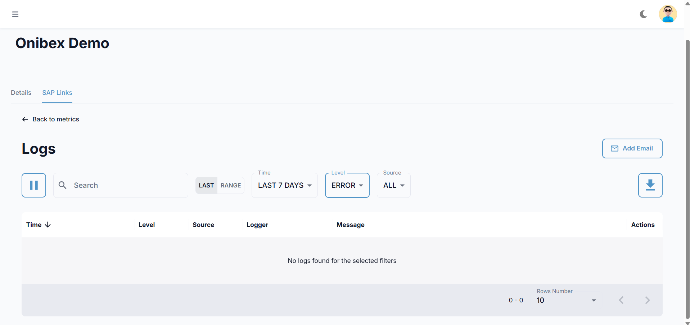
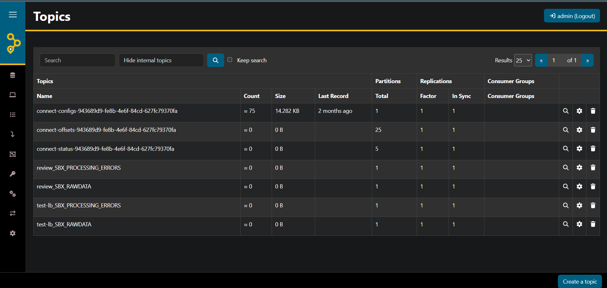

# Diagnostic Toolkit

This guide explains the three places OneConnect surfaces errors, and which log levels reach each of them.

Some diagnostic detail in the Producer and Consumer is logged at `DEBUG`, below the default root level of `INFO`. If a component appears idle, [raising the log level](#4-raising-the-log-level-to-see-more-detail) will usually reveal what it is doing.

---

## 1. The Logs Panel in the Web UI

The fastest first look. It aggregates logs from **Producer**, **Consumer**, and **SAP** for a given SAP Link.

Open your SAP Links dashboard and click **"Go to Logs"**. Filter by **Source** (`PRODUCER` / `CONSUMER` / `SAP`) and **Level** (`ERROR` / `WARN` / `FATAL`).



For the full reference on filters, the detail pop-up, Excel export, and email alerts, see [Working with Logs](../Smart_Gateway/Using_the_Smart_Gateway/07-Working_with_Logs.md).

### How the panel is fed

| Aspect | Behavior |
|---|---|
| **Levels forwarded** | `WARN`, `ERROR`, and `FATAL` |
| **Delivery** | Batched on a timer (`time.batch`, default **100 seconds**) — allow a minute or two for a new entry to appear |
| **Transport** | HTTP POST to the Logs service, authenticated with a bearer token |
| **Enabled by** | `oneconnect.flag.logs` set to `ENABLE` |

### Counting occurrences

Repeated identical messages are grouped within a batch window, so one row in the panel can represent many occurrences. To get exact counts, use the platform metrics, the record count in the `*_PROCESSING_ERRORS` topic ([§5](#5-the-error-topics)), or the pod logs ([§2](#2-reading-logs-directly-from-kubernetes)).

Messages that include per-record values (topic, key, payload) are distinct from each other and appear individually.

---

## 2. Reading Logs Directly from Kubernetes

The ground truth. Nothing is filtered, deduplicated, or delayed here.

### Find the pods

The Producer and Consumer are created per SAP Link by the Builder, so their names vary:

```bash
kubectl get pods -n oneconnect
```

```bash
# Narrow to the data pipeline workloads
kubectl get pods -n oneconnect | grep -Ei 'producer|consumer'
```

### Tail the logs

```bash
# Producer — follow live
kubectl logs -n oneconnect <producer-pod> -f

# Consumer — last 200 lines
kubectl logs -n oneconnect <consumer-pod> --tail=200

# Only errors
kubectl logs -n oneconnect <consumer-pod> --tail=500 | grep -Ei 'error|exception|fail'

# Logs from the previous container, after a crash/restart
kubectl logs -n oneconnect <producer-pod> --previous
```

### Platform services

```bash
kubectl logs -n oneconnect -l app=builder    --tail=100   # SAP Link / workload creation
kubectl logs -n oneconnect -l app=logs       --tail=100   # log ingestion service
kubectl logs -n oneconnect -l app=apigateway --tail=100   # routing / auth forwarding
kubectl logs -n oneconnect -l app=auth       --tail=100   # UI login, JWT
```

### Anatomy of an error line

Producer and Consumer emit structured errors. A typical send failure:

```
-->Error Sending Record to topic=732_DEV_MARA, key=..., value=..., errorType=SerializationException, cause=..., stackTrace=...
```

| Field | Use it for |
|---|---|
| `topic` | Which table/stage failed |
| `errorType` | The exception class — the fastest routing signal (see table below) |
| `cause` | The exception message |
| `stackTrace` | Truncated to 2000 characters — for deeper traces use the pod logs, not the UI |

### Routing an `errorType` to the right guide

| `errorType` | Go to |
|---|---|
| `SaslAuthenticationException`, `SslAuthenticationException`, `SSLHandshakeException` | [04 — Kafka Connectivity](./04-Kafka_Connectivity.md) |
| `TimeoutException`, `UnknownHostException`, `DisconnectException` | [04 — Kafka Connectivity](./04-Kafka_Connectivity.md) |
| `TopicAuthorizationException`, `ClusterAuthorizationException` | [04 — Kafka Connectivity](./04-Kafka_Connectivity.md#6-acls-and-authorization) |
| `RecordTooLargeException` | [04 — Kafka Connectivity](./04-Kafka_Connectivity.md#5-message-size-limits) |
| `SerializationException`, `RestClientException`, `AvroRuntimeException`, `SchemaParseException` | [05 — Avro & Schema Registry](./05-Avro_Serialization_and_Schema_Registry.md) |
| `NullPointerException`, `ClassCastException`, `NumberFormatException` | [05 — Avro & Schema Registry](./05-Avro_Serialization_and_Schema_Registry.md#3-nullpointerexception-on-a-field-that-is-empty-in-sap) |
| `NoSuchElementException` | [05 — Avro & Schema Registry](./05-Avro_Serialization_and_Schema_Registry.md#4-nosuchelementexception--missing-table-metadata) |
| `JsonSyntaxException`, `MalformedJsonException` | [06 — No Data Reaching Destination](./06-No_Data_Reaching_Destination.md) |

---

## 3. The Logs Panel Is Empty

Work through these in order. The first two account for most cases.

| # | Check | How | Fix |
|---|---|---|---|
| 1 | Is log shipping enabled? | `kubectl exec -n oneconnect <pod> -- env \| grep ONECONNECT_FLAG_LOGS` | Must be `ENABLE`. Set `ONECONNECT_FLAG_LOGS=ENABLE` on the Producer/Consumer workload |
| 2 | Has the batch window elapsed? | — | Wait ~100 s (or the value of `TIME_BATCH`) after the error occurs |
| 3 | Are there any `WARN`+ logs at all? | `kubectl logs -n oneconnect <pod> \| grep -E 'WARN\|ERROR\|FATAL'` | If the pod only logs `INFO`, nothing is *supposed* to be shipped. See [§4](#4-raising-the-log-level-to-see-more-detail) |
| 4 | Is the workspace ID correct? | `kubectl exec -n oneconnect <pod> -- env \| grep ONECONNECT_WORKSPACE_ID` | A wrong ID files the logs under a different SAP Link — they exist, but not where you are looking |
| 5 | Is the Logs service reachable and the token valid? | `kubectl logs -n oneconnect <pod> \| grep "ERROR sending logs"` | This line means shipping failed. Verify `ONECONNECT_LOGS_URL_PRODUCER` / `ONECONNECT_LOGS_URL_CONSUMER` and that `ONECONNECT_SOFTSECURITYTOKEN` matches the Logs service. See [03 — Authentication](./03-Authentication_and_Credentials.md#6-internal-soft-security-token) |
| 6 | Is the Logs service itself healthy? | `kubectl get pods -n oneconnect -l app=logs` | Restart it if not `Running`; check its logs for DB errors |

> ℹ️ Log-shipping status is reported on the pod's stdout (`ERROR sending logs : ...`), so check there with `kubectl logs` rather than in the UI.

### Environment variables that control log shipping

Both components read `application.properties` first, then let environment variables override:

| Variable | Purpose | Notes |
|---|---|---|
| `ONECONNECT_FLAG_LOGS` | Master on/off | Must be exactly `ENABLE` |
| `ONECONNECT_LOGS_URL_PRODUCER` | Producer → Logs service endpoint | Producer only |
| `ONECONNECT_LOGS_URL_CONSUMER` | Consumer → Logs service endpoint | Consumer only |
| `ONECONNECT_WORKSPACE_ID` | Tags each log with its SAP Link | Also used by the JSON layout |
| `ONECONNECT_SOFTSECURITYTOKEN` | Bearer token for the Logs service | Must match the Logs service |
| `TIME_BATCH` | Batch interval in **seconds** | Lower it temporarily while debugging |

---

## 4. Raising the Log Level to See More Detail

Several operations report their outcome at `DEBUG`, below the default root level of `INFO`. Raising the verbosity makes them visible. The ones most often needed while diagnosing:

| Operation | Reported at | Where to look for it |
|---|---|---|
| Kafka **topic creation** | `DEBUG` | Pod logs, once `DEBUG` is enabled |
| **Sink connector** auto-creation (on-premise deployments) | `DEBUG` | Pod logs, once `DEBUG` is enabled |
| Asynchronous **record send** outcome in the Producer | `INFO` | `kubectl logs` — below the level forwarded to the UI |
| Authorization result on the asynchronous Producer endpoint | — | The HTTP status code returned to SAP |

### How to enable DEBUG temporarily

Set the root level via the standard Log4j2 property on the workload:

```bash
kubectl set env deployment/<producer-or-consumer-deployment> -n oneconnect \
  LOGGING_LEVEL_ROOT=DEBUG
```

If that does not take effect, override the Log4j2 root level directly:

```bash
kubectl set env deployment/<producer-or-consumer-deployment> -n oneconnect \
  JAVA_TOOL_OPTIONS="-Dlog4j2.level=DEBUG"
```

Then reproduce the problem and read the pod logs:

```bash
kubectl logs -n oneconnect <pod> -f | grep -Ei 'topic|error|exception'
```

> ⚠️ **Revert when you are done.** `DEBUG` logs every record's key and value, which is verbose and will place business data in pod logs.

```bash
kubectl set env deployment/<deployment> -n oneconnect LOGGING_LEVEL_ROOT-
```

> 📌 Raising the level to `DEBUG` does **not** flood the UI panel: the appender still forwards only `WARN` and above. The extra detail appears in `kubectl logs` only.

---

## 5. The Error Topics

Records that cannot be processed are preserved in dedicated Kafka topics. These are the most useful diagnostic source, because each entry carries both the error and the payload that produced it.

| Topic | Written by | Contains |
|---|---|---|
| `<CLIENT>_<ENV>_INBOUND_ERRORS` | Producer | Payloads from SAP that were not valid JSON |
| `[<CLIENT>_<ENV>_]PROCESSING_ERRORS` | Consumer | Records that failed Avro conversion or the Kafka send |

The Consumer's prefix is applied only when `sapproperties.useprefix` is `ENABLE`; otherwise the topic is simply `PROCESSING_ERRORS`.

Each `PROCESSING_ERRORS` entry has the shape:

```
Failed to send message
Error: <exception message>
Data: <the original record>
```

### Inspecting them in AKHQ

AKHQ is the Kafka UI deployed alongside the Kafka platform. Get its address with:

```bash
kubectl get svc -n kafka | grep akhq
```

Open the external IP in a browser, then:

1. Go to **Topics** and locate the `*_ERRORS` topic.
2. The topic list shows the **record count**, which is how many records have failed in total.
3. Open the **Data** tab to read the entries. Each shows the `Error:` line and the `Data:` payload together.
4. The `Data:` block is the exact payload to replay once the root cause is resolved.



> 💡 The record count in this topic is the authoritative figure for how many records failed, since repeated identical messages are grouped in the UI panel ([§1](#counting-occurrences)).

---

## 6. A Five-Minute Health Check

Run this sequence before deep-diving. It localizes the fault to a single layer.

```bash
# 1. Is every platform pod up?
kubectl get pods -n oneconnect
kubectl get pods -n kafka

# 2. Does the Producer answer? (expects HTTP 200)
kubectl exec -n oneconnect <producer-pod> -- \
  curl -s -o /dev/null -w "%{http_code}\n" \
  http://localhost:50501/api/v1/saplistener/<workspace-id>

# 3. Is the Kafka cluster itself healthy?
kubectl get kafka -n kafka
kubectl get pods -n kafka

# 4. Get the AKHQ address for the remaining checks
kubectl get svc -n kafka | grep akhq
```

Then, in AKHQ:

| # | Check | Where in AKHQ |
|---|---|---|
| 5 | Do the topics exist, and is the raw topic growing? | **Topics** — the list shows every topic with its record count |
| 6 | Is the Consumer keeping up? | **Consumer Groups** → `group_0` — `LAG` should be near zero |
| 7 | Is anything landing in the error topics? | **Topics** → `*_ERRORS` — check the record count |

Interpreting the result:

| Result | Fault is in | Guide |
|---|---|---|
| Pods not `Running` | Deployment | [02](./02-Deployment_and_Installation.md) |
| Step 2 returns `401` / `000` | Authentication / networking | [03](./03-Authentication_and_Credentials.md) |
| Raw topic missing or not growing | SAP → Producer → Kafka | [03](./03-Authentication_and_Credentials.md), [04](./04-Kafka_Connectivity.md) |
| Raw topic grows, per-table topics do not | Consumer / Avro | [05](./05-Avro_Serialization_and_Schema_Registry.md) |
| Consumer lag climbing steadily | Consumer throughput or crash loop | [06](./06-No_Data_Reaching_Destination.md) |
| Per-table topics grow, destination empty | Kafka Connect / sink | [06](./06-No_Data_Reaching_Destination.md) |
| `PROCESSING_ERRORS` growing | Avro / data quality | [05](./05-Avro_Serialization_and_Schema_Registry.md) |

---

## Summary

1. Start with the **UI Logs panel**: it carries `WARN` and above, batched every ~100 s.
2. Use **`kubectl logs`** for the unfiltered view, and route by `errorType`.
3. **Raise the log level to `DEBUG`** for detail on topic and connector creation.
4. Read the **error topics** to get the failing payload alongside the error.
5. Run the **five-minute health check** to localize the issue before opening a specific guide.
